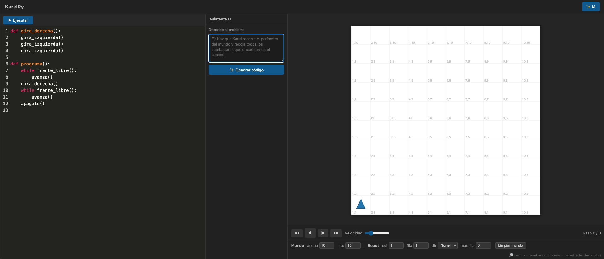

# KarelPy

Aplicación web para programar y visualizar al robot Karel, con sintaxis estilo Python en español. Inspirada en [karel.js de OmegaUp](https://omegaup.com/karel.js/).



## Características

- Sintaxis Python con comandos en español
- Editor de código con resaltado de sintaxis (CodeMirror)
- Visualización del mundo Karel en canvas con animación paso a paso
- Controles de reproducción: play, pausa, paso adelante, paso atrás, ir al inicio/final
- Editor visual del mundo: click para agregar/quitar zumbadores y paredes
- Soporte de funciones recursivas
- Detección de ciclos infinitos (límite de 10,000 instrucciones)
- Mensajes de error con número de línea
- **Asistente IA**: generación de código Karel a partir de una descripción en lenguaje natural, usando OpenAI GPT-4o

## Estructura del proyecto

```
karelpy/
├── karelpy/              # Motor Karel (paquete Python puro)
│   ├── errors.py         # Jerarquía de excepciones
│   ├── ast_nodes.py      # Nodos del árbol sintáctico (AST)
│   ├── lexer.py          # Tokenizador con soporte de indentación Python
│   ├── parser.py         # Parser recursivo descendente
│   ├── world.py          # Estado del mundo (celdas, paredes, zumbadores)
│   ├── robot.py          # Estado del robot (posición, dirección, mochila)
│   └── interpreter.py    # Motor de ejecución con registro de snapshots
│
├── web/                  # Capa web (FastAPI)
│   ├── app.py            # Aplicación FastAPI
│   ├── routes/
│   │   ├── run.py        # POST /api/run
│   │   └── generate.py   # POST /api/generate (generación con IA)
│   ├── static/
│   │   ├── style.css     # Estilos (tema oscuro)
│   │   └── app.js        # Lógica del frontend (WorldRenderer + KarelApp + AiPanel)
│   └── templates/
│       └── index.html    # Interfaz principal
│
├── tests/                # Tests unitarios
│   ├── test_lexer.py
│   ├── test_parser.py
│   └── test_interpreter.py
│
└── pyproject.toml
```

## Arquitectura del backend

El motor Karel sigue el pipeline clásico de un compilador:

```
Código fuente
    → Lexer       → lista de tokens
    → Parser      → árbol sintáctico (AST)
    → Interpreter → lista de snapshots
```

### Approach: Execution Trace

El intérprete no devuelve solo el estado final — registra un **snapshot del mundo después de cada instrucción primitiva** (`avanza`, `gira_izquierda`, `coge_zumbador`, `deja_zumbador`). El frontend recibe la lista completa de snapshots y los anima con un timer controlable.

Esto permite:
- Reproducción hacia adelante y hacia atrás
- Control de velocidad
- Saltar a cualquier paso

### API

```
POST /api/run
Body:  { "code": "...", "world": {...}, "robot": {...} }

Respuesta exitosa:
{ "ok": true, "steps": [ { "robot": {...}, "beepers": {...} }, ... ] }

Respuesta con error:
{ "ok": false, "error": "mensaje", "line": 5 }


POST /api/generate
Body:  { "prompt": "Haz que Karel recorra el perímetro del mundo" }

Respuesta exitosa:
{ "ok": true, "code": "def programa():\n    ..." }

Respuesta con error:
{ "ok": false, "error": "mensaje" }
```

### Sistema de coordenadas

- `(1, 1)` es la esquina inferior izquierda
- `col` aumenta hacia el este
- `row` aumenta hacia el norte
- La mochila acepta `-1` como valor de zumbadores infinitos

## Asistente IA

KarelPy incluye un panel de generación de código con LLM. Al hacer click en **✨ IA** en el header se abre un panel lateral donde el usuario describe el problema en lenguaje natural y recibe código KarelPy listo para ejecutar.

### Cómo funciona

El endpoint `POST /api/generate` construye un prompt con:
1. El manual completo de sintaxis (`SINTAXIS.md`) como referencia del lenguaje
2. Cinco ejemplos few-shot de problemas Karel y sus soluciones
3. La descripción del usuario

Esto le da al modelo suficiente contexto para generar código correcto sin necesidad de fine-tuning. El código generado se extrae del bloque ` ```python ``` ` de la respuesta y se devuelve al frontend, donde el usuario puede insertarlo en el editor con un click.

### Configuración

Requiere una API key de OpenAI. Agrégala en un archivo `.env` en la raíz del proyecto:

```
OPENAI_API_KEY=sk-...
```

El modelo por defecto es `gpt-4o`. No se necesita entrenamiento adicional ni base de conocimiento externa.

---

## Instalación

Requiere Python 3.11 o superior.

```bash
# Instalar el paquete en modo editable
pip install -e ".[dev,web]"
```

## Uso

```bash
# Correr el servidor
uvicorn web.app:app --reload

# Abrir en el navegador
# http://localhost:8000
```

## Tests

```bash
pytest tests/
```

## Sintaxis

Ver [SINTAXIS.md](SINTAXIS.md) para el manual completo del lenguaje.
